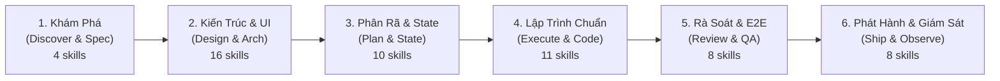
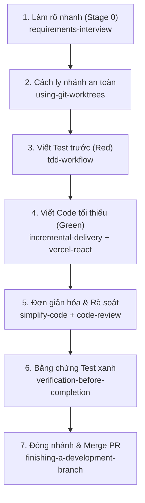
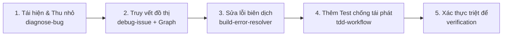
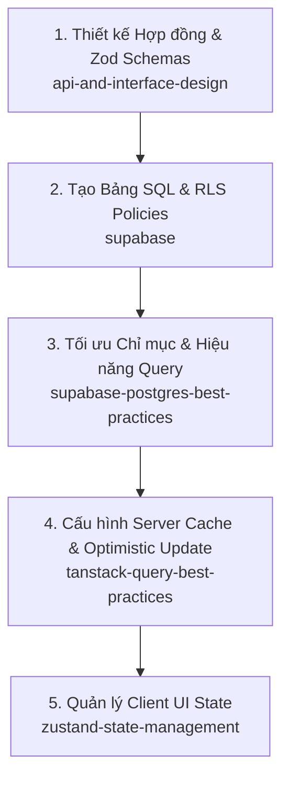
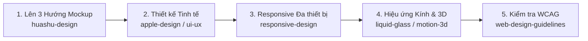
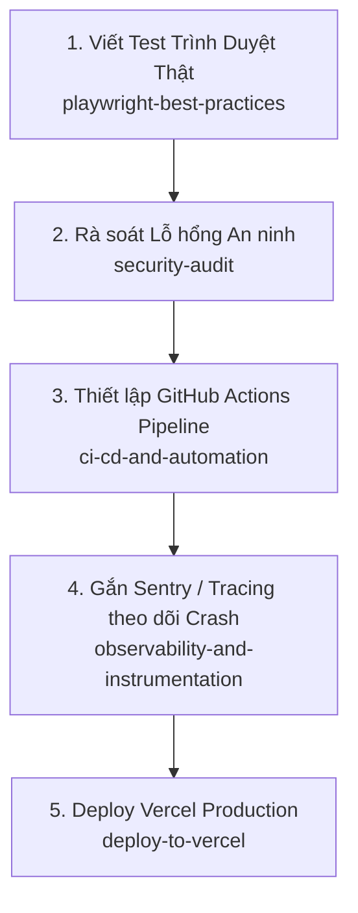

# 🏢 Agent Workflow Skill
## Một Tổng Công Ty Agents AI Độc Lập Chuẩn Enterprise Production
### The All-in-One Standalone AI Agent Software Company (59 Skills · 6 Phases)

[]()
[]()
[]()
[]()
[]()

---

> **English Summary**: `agent-workflow-skill` is a battle-tested, all-in-one AI agent operating system.
> It packages **59 production-grade engineering skills** into a cohesive **6-phase development lifecycle**,
> functioning as an entire senior software engineering company inside your AI coding assistant.
> It features **100% standalone offline capability**, an **autonomous routing engine** (`AGENTS.md`),
> and native support for Antigravity, Claude Code, Cursor, Windsurf, OpenAI Codex, and Grok.

---

## 🌟 TẠI SAO ĐÂY LÀ "CẢ MỘT TỔNG CÔNG TY AI SENIOR"?

Hầu hết mọi người khi dùng AI thường chỉ dừng lại ở việc gõ prompt lẻ tẻ hoặc cài một vài snippet rời rạc. Hậu quả là: AI sinh code cẩu thả, không có kiến trúc, không kiểm thử, dễ vỡ và không thể đưa vào production thực tế.

**`agent-workflow-skill` giải quyết triệt để vấn đề này.** Bộ khung này tổ chức lại AI của bạn hoạt động chính xác như một **Công ty Công nghệ Cấp Cao (Senior Digital Agency / Tech Enterprise)** với đầy đủ các ban ngành chuyên trách:

```
                          ┌───────────────────────────────────────────────┐
                          │   🏢 TỔNG CÔNG TY AI SOFTWARE ENGINEERING     │
                          │   (59 Chuyên Gia Cao Cấp · 6 Giai Đoạn Chuẩn) │
                          └──────────────────────┬────────────────────────┘
                                                 │
      ┌──────────────────┬───────────────────────┼───────────────────────┬──────────────────┐
      │                  │                       │                       │                  │
┌─────▼──────┐    ┌──────▼──────┐         ┌──────▼──────┐         ┌──────▼──────┐    ┌──────▼──────┐
│ 🎯 Ban PM  │    │ 🏛️ Ban Kiến │         │ 🎨 Ban Thiết│         │ ⚛️ Khối Lập  │    │ 🚀 Ban      │
│ & BA       │    │ trúc Sư     │         │ kế UI/UX    │         │ trình Full  │    │ DevOps, CI  │
│ Sản Phẩm   │    │ Hệ Thống    │         │ & Design    │         │ Frontend/DB │    │ & Vận Hành  │
└─────┬──────┘    └──────┬──────┘         └──────┬──────┘         └──────┬──────┘    └──────┬──────┘
      │                  │                       │                       │                  │
  4 Skills           5 Skills                11 Skills               19 Skills          20 Skills
  - Phỏng vấn        - Domain Design         - 50+ Design Styles     - React/Vite Perf  - GitHub Actions
  - Brainstorming    - API Contracts (Zod)   - Apple HIG / Glass     - Supabase Backend - Playwright E2E
  - Làm rõ scope     - Schema & RLS          - 3D Motion Shaders     - TanStack Cache   - Sentry / Tracing
  - Thách thức plan  - Postgres Tuning       - Mobile HIG Design     - Zustand Store    - Vercel Deploy
```

---

## 💎 3 ĐỘT PHÁ CỐT LÕI (CORE ADVANTAGES)

### 1. 📦 100% All-in-One Standalone (Hoạt động Độc lập Tuyệt đối)
- Không phụ thuộc vào kết nối mạng khi gọi skill. Tất cả 59 skills đã được tích hợp sẵn cục bộ trong thư mục `skills/`.
- Clone về máy là chạy ngay lập tức. Bất kỳ thành viên nào trong team hay bất kỳ môi trường CI/CD nào cũng có thể khởi chạy mà không cần cấu hình phức tạp.

### 2. 🤖 Tự Động Điều Phối (Zero Manual Prompts)
- Người dùng **KHÔNG CẦN** phải nhớ tên skill hay gõ cú pháp slash command lằng nhằng.
- Bộ não điều phối `AGENTS.md` chứa bảng **Auto-Routing Table 59 dòng** và **Decision Tree**. AI sẽ tự lắng nghe ngôn ngữ tự nhiên của bạn, phân tích mục đích (intent) và tự động triệu hồi đúng chuyên gia vào đúng lúc:
  - Bạn nói: *"Tôi có ý tưởng làm web đặt bàn"* ➔ AI tự kích hoạt Phase 1 (`brainstorming` + `requirements-interview`).
  - Bạn nói: *"Thiết kế API cho giỏ hàng"* ➔ AI tự gọi Phase 2 (`api-and-interface-design`).
  - Bạn nói: *"Quản lý state giỏ hàng và cache danh sách món"* ➔ AI tự gọi Phase 3 (`zustand-state-management` + `tanstack-query-best-practices`).
  - Bạn nói: *"Có lỗi crash trang thanh toán"* ➔ AI tự kích hoạt Phase 4 (`diagnose-bug` + `debug-issue`).
  - Bạn nói: *"Viết test luồng thanh toán và gắn CI"* ➔ AI tự gọi Phase 5 & 6 (`playwright-best-practices` + `ci-cd-and-automation`).

### 3. 🛡️ Quy Chuẩn Enterprise Production
- **Không bao giờ làm bừa (Stage 0 Clarification)**: Luôn làm rõ yêu cầu trước khi gõ code.
- **Test-Driven & Verification**: Không bao giờ tuyên bố hoàn thành nếu không có bằng chứng test xanh (`verification-before-completion`).
- **Không Over-engineering**: Tuân thủ triết lý tối giản của Andrej Karpathy (`karpathy-guidelines`).

---

## 🔄 QUY TRÌNH 6 PHA PHÁT TRIỂN (THE 6-PHASE ENTERPRISE LIFECYCLE)



### Chi tiết các Pha:

| Pha | Vai trò trong Tổng Công Ty | Nhiệm vụ chính | Kỹ năng tiêu biểu |
|---|---|---|---|
| **Phase 1: Discover & Spec** | Ban Giám đốc Sản phẩm & BA | Khám phá ý tưởng thô, phỏng vấn bóc tách yêu cầu, thách thức các giả định mơ hồ. | `brainstorming`, `requirements-interview`, `grill-me`, `idea-expansion` |
| **Phase 2: Design & Arch** | Ban Kiến trúc Sư & Giám đốc UI/UX | Thiết kế giao diện (Apple, Web, Mobile), thiết kế hợp đồng API Type-safe (Zod), kiến trúc Supabase DB & RLS. | `api-and-interface-design`, `ui-ux-pro-max`, `apple-design`, `supabase`, `design-and-document` |
| **Phase 3: Plan & State** | Lead Engineer & Technical PM | Lập kế hoạch phân rã task, thiết kế Server Data Cache, Client State Store, cấu trúc đa ngôn ngữ. | `tanstack-query-best-practices`, `zustand-state-management`, `react-state-management`, `internationalization-i18n`, `plan-tasks` |
| **Phase 4: Execute & Code** | Senior Fullstack Developers | Lập trình từng bước nhỏ (Incremental), TDD Red-Green-Refactor, tối ưu render React/Vite, xử lý bug triệt để. | `tdd-workflow`, `incremental-delivery`, `vercel-react-best-practices`, `diagnose-bug`, `build-error-resolver` |
| **Phase 5: Review & QA** | Ban Kiểm thử & An ninh Mạng | Chạy test trình duyệt E2E tự động (Playwright), rà soát bảo mật RLS/XSS, phân tích bán kính ảnh hưởng mã nguồn. | `playwright-best-practices`, `code-review`, `security-audit`, `verification-before-completion`, `simplify-code` |
| **Phase 6: Ship & Observe** | Kỹ sư DevOps, SRE & Release Manager | Tự động hóa pipeline GitHub Actions CI/CD, gắn Sentry/Tracing theo dõi crash runtime, audit SEO, deploy Vercel. | `ci-cd-and-automation`, `observability-and-instrumentation`, `deploy-to-vercel`, `seo-audit`, `audit-website` |

---

---

## 🔬 HỆ THỐNG WORKFLOW VI MÔ CHI TIẾT (THE MICRO-WORKFLOW ENGINE)

Trong khi **Macro-Workflow (6 Pha)** đóng vai trò là chiếc la bàn chiến lược cho toàn bộ dự án từ A-Z, thì **Micro-Workflow** chính là cỗ máy tác chiến hàng ngày. 

> **90% thời gian bạn làm việc với AI sẽ là các câu lệnh nhỏ:** sửa một con bug, dựng một component, tạo một bảng database, hay viết test. Nếu không có quy trình vi mô, AI sẽ nhảy bổ vào code ẩu và làm hỏng dự án. Dưới đây là **5 Micro-Workflows chuẩn Enterprise** được cài đặt sẵn vào bộ não của AI:

---

### 🔄 Micro-Workflow 1: Vòng Lặp Phát Triển Tính Năng / Task Nhỏ (Feature Task Loop)
Áp dụng khi người dùng yêu cầu: *"Thêm nút like bài viết"*, *"Tạo form đổi mật khẩu"*, *"Thêm bộ lọc tìm kiếm"*.



- **Bước 1 — Làm rõ nhanh**: AI đặt câu hỏi làm rõ các trường hợp biên (edge cases) trước khi gõ code.
- **Bước 2 — Cách ly không gian làm việc**: Tạo nhánh hoặc git worktree độc lập để không làm bẩn code đang chạy.
- **Bước 3 — Viết Test thất bại trước (TDD Red)**: Viết test case kỳ vọng kết quả, xác nhận test fail.
- **Bước 4 — Triển khai mã nguồn (TDD Green)**: Viết code tối giản nhất để test pass, tuân thủ render tối ưu của Vercel.
- **Bước 5 — Tinh giản & Review**: Loại bỏ abstraction thừa thãi, rà soát code theo đa tiêu chí.
- **Bước 6 — Xác thực bằng chứng**: Bắt buộc chạy lệnh test thực tế và hiển thị output xanh.
- **Bước 7 — Merge**: Đóng gói commit gọn gàng và hoàn tất nhánh.

---

### 🐛 Micro-Workflow 2: Vòng Lặp Bắt Bệnh & Sửa Lỗi Khó (Hard Bug Diagnosis Loop)
Áp dụng khi người dùng báo: *"Web bị crash"*, *"API trả về 500"*, *"Bộ nhớ tăng bất thường"*, *"Code không chạy như mong muốn"*.



- **Bước 1 — Tái hiện & Thu nhỏ (Reproduce & Minimize)**: Tìm điều kiện tối thiểu để kích hoạt bug, không sửa mò.
- **Bước 2 — Đặt giả thuyết & Đo đạc (Instrument & Trace)**: Dùng `code-review-graph` truy vết chuỗi hàm gọi (call stack) và dependencies.
- **Bước 3 — Sửa lỗi tối thiểu**: Tạo diff nhỏ nhất có thể, tránh sửa lan man gây hiệu ứng phụ.
- **Bước 4 — Regression Test**: Viết 1 test case khóa chặt con bug này lại để vĩnh viễn không bao giờ tái phát.
- **Bước 5 — Kiểm tra bằng chứng**: Chạy test và xác nhận bug đã bị tiêu diệt hoàn toàn.

---

### 💾 Micro-Workflow 3: Vòng Lặp Hợp Đồng Dữ Liệu & State (Contract, DB & State Loop)
Áp dụng khi người dùng yêu cầu: *"Tạo bảng thanh toán trong DB"*, *"Lưu giỏ hàng và cache danh sách món"*.



- **Bước 1 — API Contract**: Định nghĩa Zod Schema và TypeScript interface chuẩn (Type-Safe từ Server đến Client).
- **Bước 2 — Supabase Migration & RLS**: Tạo file migration SQL với Row Level Security chống rò rỉ dữ liệu.
- **Bước 3 — Database Indexing**: Đánh index chuẩn cho các cột lọc/sort, kiểm tra query execution plan.
- **Bước 4 — Server Caching**: Cấu hình `staleTime`, `gcTime`, cơ chế tự làm mới dữ liệu và cập nhật lạc quan (Optimistic UI) bằng TanStack Query.
- **Bước 5 — Client State Store**: Lưu trữ trạng thái UI thuần túy (modal, draft form, active tab) trong Zustand store nhỏ gọn.

---

### 🎨 Micro-Workflow 4: Vòng Lặp Chế Tác Giao Diện Đỉnh Cao (UI/UX Crafting Loop)
Áp dụng khi người dùng yêu cầu: *"Làm giao diện trang chủ thật xịn"*, *"Thêm hiệu ứng kính mờ"*, *"Dựng mockup"*.



- **Bước 1 — Prototype 3 hướng**: Luôn đưa ra 3 phương án visual để người dùng lựa chọn.
- **Bước 2 — Áp dụng Design System**: Dùng bảng màu và kiểu chữ cao cấp (Apple HIG hoặc Material 3).
- **Bước 3 — Responsive chuẩn Container Queries**: Đảm bảo hiển thị hoàn hảo trên Mobile, Tablet, Desktop.
- **Bước 4 — Nâng tầm Visual**: Thêm hiệu ứng kính mờ chuẩn quang học (`liquid-glass-frosted`) hoặc hoạt ảnh chuyển động 3D (`motion-3d`).
- **Bước 5 — Rà soát tiếp cận (A11y)**: Kiểm tra độ tương phản màu, hỗ trợ phím Tab và nhãn aria.

---

### 🚀 Micro-Workflow 5: Vòng Lặp Kiểm Thử Trình Duyệt & Phát Hành (E2E & Release Loop)
Áp dụng khi người dùng yêu cầu: *"Test luồng mua hàng"*, *"Gắn CI/CD"*, *"Theo dõi lỗi production"*.



- **Bước 1 — Playwright E2E**: Chạy headless browser mô phỏng chính xác thao tác click, gõ phím, auth của người dùng thật.
- **Bước 2 — Security Audit**: Quét bảo mật JWT, cookie flags, lỗ hổng SQLi, XSS.
- **Bước 3 — CI/CD Automation**: Tự động kích hoạt test và lint mỗi khi mở Pull Request.
- **Bước 4 — Observability & Error Alerts**: Gắn Sentry Error Boundary để bắt trọn mọi lỗi crash khi người dùng thực tế sử dụng.
- **Bước 5 — Production Deploy**: Đẩy bản build sạch lên Vercel Edge Network.

---

## 📋 DANH MỤC 59 KỸ NĂNG (THE 59-SKILL CATALOG)

### 1. Khám Phá & Sản Phẩm (4 Skills)
- `brainstorming`: Khám phá ý tưởng thành đặc tả chi tiết.
- `requirements-interview`: Phỏng vấn bóc tách yêu cầu nghiệp vụ chuyên sâu.
- `idea-expansion`: Mở rộng góc nhìn và phân tích đa phương án.
- `grill-me`: Thách thức và phản biện gay gắt kế hoạch thiết kế.

### 2. Thiết Kế Giao Diện & Trải Nghiệm (11 Skills)
- `ui-ux-pro-max`: Bách khoa toàn thư UI/UX (50+ styles, 161 bảng màu, 57 font pairings).
- `frontend-design`: Thiết kế giao diện đặc sắc, cao cấp, phi khuôn mẫu.
- `apple-design`: Ngôn ngữ thiết kế tối giản, thanh lịch chuẩn Apple HIG.
- `liquid-glass-frosted`: Hiệu ứng kính mờ (Frosted glass) với độ khúc xạ chuẩn xác.
- `motion-3d`: Hoạt ảnh 3D cao cấp (Three.js, WebGL, Shader, GSAP).
- `canvas-design`: Tạo tác phẩm nghệ thuật, banner, đồ họa vector bằng mã nguồn.
- `huashu-design`: Thiết kế 3 hướng prototype độ trung thực cao để lựa chọn.
- `web-design` & `web-design-guidelines`: Kiểm tra khả năng tiếp cận và chuẩn web WCAG.
- `responsive-design`: Bố cục đáp ứng đa màn hình với Container Queries.
- `mobile-ios-design`: Thiết kế giao diện iOS chuẩn SwiftUI/HIG.
- `mobile-android-design`: Thiết kế giao diện Android chuẩn Material Design 3.

### 3. Kiến Trúc Hệ Thống & Hợp Đồng Dữ Liệu (5 Skills)
- `api-and-interface-design`: Thiết kế chuẩn REST/RPC, Zod schemas và type contracts (Addy Osmani - Google).
- `design-and-document`: Lưu trữ kiến trúc hệ thống (ADR) và mô hình miền (CONTEXT.md).
- `improve-architecture`: Phát hiện module ghép nối chặt và tái cấu trúc hệ thống.
- `supabase`: Quản trị toàn diện Supabase (Database, Auth, Storage, Edge Functions, RLS).
- `supabase-postgres-best-practices`: Tối ưu hóa truy vấn Postgres, index và cấu hình bảo mật.

### 4. Quản Lý State, Caching & Lập Kế Hoạch (10 Skills)
- `tanstack-query-best-practices`: Chiến lược server cache, revalidation và optimistic updates.
- `zustand-state-management`: Kiến trúc client state store nhẹ, tách slices và middleware persist.
- `react-state-management`: Quản lý kiến trúc state React tổng thể (Context vs Store).
- `internationalization-i18n`: Cấu trúc đa ngôn ngữ i18n, quản lý file dịch thuật và locale format.
- `plan-tasks`: Phân rã epic thành chuỗi nhiệm vụ logic, tuần tự.
- `using-git-worktrees`: Tạo không gian làm việc cô lập an toàn bằng Git Worktrees.
- `dispatching-parallel-agents`: Điều phối nhiều sub-agents chạy song song độc lập.
- `karpathy-guidelines`: Quy tắc tối giản của Andrej Karpathy, chặn đứng over-engineering.
- `explore-codebase`: Khám phá mã nguồn bằng Knowledge Graph.
- `find-skills`: Tìm kiếm và bổ sung kỹ năng mới từ hệ sinh thái open agent skills.

### 5. Lập Trình & Sửa Lỗi Chuyên Sâu (11 Skills)
- `incremental-delivery`: Triển khai mã nguồn theo từng lát cắt nhỏ, kiểm thử chắc chắn.
- `subagent-driven-development`: Thực thi kế hoạch lập trình thông qua sub-agents chuyên biệt.
- `tdd-workflow`: Quy trình phát triển hướng kiểm thử Red-Green-Refactor (độ phủ 80%+).
- `vercel-react-best-practices`: Tối ưu hóa hiệu năng render, bundle size từ Vercel Engineering.
- `vercel-react-view-transitions`: Hiệu ứng chuyển trang mượt mà với View Transition API.
- `react-native-design`: Lập trình thành phần React Native và Reanimated animations.
- `vercel-react-native-skills`: Tối ưu danh sách mượt mà (FlashList) và bộ nhớ mobile.
- `diagnose-bug`: Quy trình bắt bệnh phần mềm 6 bước nghiêm ngặt.
- `debug-issue`: Truy vết lỗi bằng biểu đồ tri thức mã nguồn.
- `build-error-resolver`: Khắc phục lỗi TypeScript / Vite build thần tốc với diff tối thiểu.
- `refactor-safely`: Kế hoạch tái cấu trúc an toàn dựa trên đồ thị phụ thuộc.

### 6. Rà Soát Chất Lượng & Kiểm Thử QA (8 Skills)
- `playwright-best-practices`: Kiểm thử tự động E2E trên trình duyệt thật (Currents-dev).
- `code-review`: Rà soát mã nguồn đa chiều trước khi merge.
- `review-changes`: Đánh giá bán kính ảnh hưởng của pull request.
- `simplify-code`: Đơn giản hóa mã nguồn, loại bỏ trừu tượng thừa.
- `security-audit`: Rà soát lỗ hổng an ninh (OWASP, SQLi, XSS, RLS leak).
- `tester`: Bảng kiểm soát chất lượng và kế hoạch rollback trước khi phát hành.
- `verification-before-completion`: Bắt buộc cung cấp bằng chứng thực tế trước khi kết thúc task.
- `document-decisions`: Ghi nhận quyết định kỹ thuật vào tài liệu dự án.

### 7. DevOps, CI/CD, Giám Sát & Vận Hành (8 Skills)
- `ci-cd-and-automation`: Thiết lập GitHub Actions, kiểm thử tự động trên PR, semantic release (Addy Osmani).
- `observability-and-instrumentation`: Gắn Sentry, OpenTelemetry, thu thập log và cảnh báo runtime lỗi (Addy Osmani).
- `deploy-to-vercel`: Triển khai ứng dụng lên nền tảng Vercel trong tích tắc.
- `vercel-cli-with-tokens`: Tự động hóa thao tác Vercel bằng Token CI/CD.
- `audit-website`: Quét toàn diện website với hơn 260 quy tắc (Squirrelscan).
- `seo-audit`: Tối ưu hóa SEO kỹ thuật, thẻ Meta, Open Graph và Schema JSON-LD.
- `finishing-a-development-branch`: Đóng gói nhánh phát triển, squash commit và tạo PR chuẩn mực.
- `using-superpowers`: Khởi tạo công cụ và điều phối meta khi bắt đầu phiên làm việc.

### 8. Meta Communication (2 Skills)
- `using-superpowers`: Khởi tạo cấu hình và kích hoạt các giác quan AI.
- `caveman-mode`: Chế độ giao tiếp siêu ngắn gọn, tiết kiệm 75% tokens khi cần.

---

## ⚡ HƯỚNG DẪN CÀI ĐẶT & SỬ DỤNG (QUICK START)

### Cài đặt vào Dự Án của bạn

Chỉ cần sao chép toàn bộ thư mục này hoặc clone vào dự án của bạn:

```bash
# Clone bộ kỹ năng vào thư mục gốc của dự án
git clone https://github.com/Snowbal-Dev/agent-workflow.git ./agent-workflow

# Hoặc copy thư mục skills và các file rules vào dự án của bạn
cp -r ./agent-workflow/skills ./.agents/skills
cp ./agent-workflow/AGENTS.md ./AGENTS.md
```

### Tương Thích Với Mọi Nền Tảng AI

- **Antigravity / Gemini**: Đã cấu hình sẵn `GEMINI.md` và tải tự động qua `.agents/skills`.
- **Claude Code**: Tự động nhận diện `CLAUDE.md` và nạp toàn bộ 59 skills từ `skills/`.
- **Cursor IDE / Windsurf**: Tự động nhận diện `.cursorrules` và `.windsurfrules`.
- **OpenAI Codex / GPT-4o / Grok**: Đọc chỉ dẫn tối cao tại `AGENTS.md`.

---

## 🔌 CÀI ĐẶT 2 MCP SERVERS BẮT BUỘC (CRITICAL ENGINES)

Để "Tổng Công Ty AI" phát huy 100% sức mạnh, hãy cài đặt 2 máy chủ MCP sau:

1. **`code-review-graph` (Knowledge Graph Engine)**
   - *Tác dụng*: Vẽ biểu đồ tri thức toàn bộ codebase, giúp AI đọc code nhanh gấp 10 lần và tiết kiệm 80% token.
   - *Hướng dẫn chi tiết*: [mcp/code-review-graph-setup.md](mcp/code-review-graph-setup.md)
2. **`supabase` (Database MCP Engine)**
   - *Tác dụng*: Cho phép AI truy vấn schema, kiểm tra RLS, chạy migration trực tiếp vào database.
   - *Hướng dẫn chi tiết*: [mcp/supabase-setup.md](mcp/supabase-setup.md)

---

## 📄 LICENSE

Phát hành dưới giấy phép mã nguồn mở [MIT License](LICENSE).
Tự do sử dụng, chỉnh sửa và đóng gói cho các dự án thương mại hoặc cá nhân.