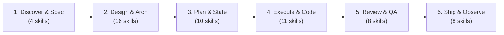
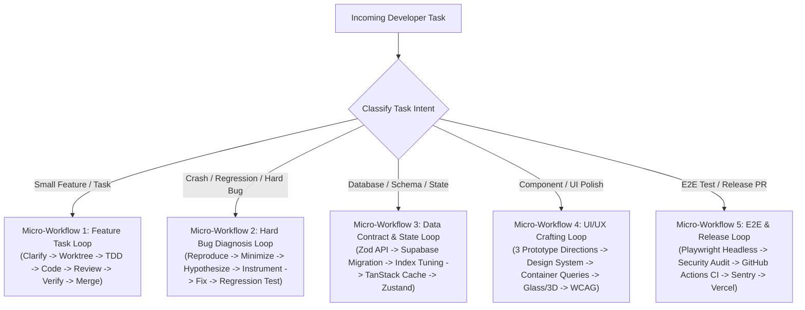

# 🏢 Agent Workflow
## The Complete AI Agent Software Engineering Enterprise
### 59 Production-Grade Skills · 6-Phase Lifecycle · 5 Operational Micro-Loops · 100% Standalone Offline

[]()
[]()
[]()
[]()
[]()
[]()

---

## ⚡ Executive Summary

**Agent Workflow** transforms your AI coding assistant (Claude Code, Cursor, Antigravity, Windsurf, or Codex) from a simple autocomplete bot into an **entire Senior Software Engineering Organization**.

Instead of writing unverified code, hallucinating APIs, or suppressing TypeScript errors, your agent adheres to an **autonomous 6-phase development lifecycle**, **5 operational micro-loops**, and **immutable constitutional engineering rules** inspired by Andrej Karpathy (Tesla/OpenAI) and Addy Osmani (Google).

All **59 battle-tested skills** are packaged **100% standalone offline** — clone and run with zero external dependencies.

> 🇻🇳 **Dành cho lập trình viên Việt Nam**: `agent-workflow` đóng gói cả một "Tổng Công Ty 59 AI Agents Senior" hoạt động hoàn toàn độc lập 100% offline. Với quy trình 6 pha Enterprise, 5 vòng lặp vi mô và luật thép chống code ẩu (Karpathy Guidelines + Strict TypeScript), AI sẽ tự động lắng nghe ngôn ngữ tự nhiên để kích hoạt đúng chuyên gia mà bạn không cần phải gõ câu lệnh hay nhớ tên skill thủ công.

---

## 🏛️ The AI Software Agency Architecture

```
                          ┌───────────────────────────────────────────────┐
                          │   🏢 ENTERPRISE AI SOFTWARE AGENCY (v1.1.0)   │
                          │   (59 Specialized Skills · 7 Departments)     │
                          └──────────────────────┬────────────────────────┘
                                                 │
      ┌──────────────────┬───────────────────────┼───────────────────────┬──────────────────┐
      │                  │                       │                       │                  │
┌─────▼──────┐    ┌──────▼──────┐         ┌──────▼──────┐         ┌──────▼──────┐    ┌──────▼──────┐
│ 🎯 Product │    │ 🏛️ System   │         │ 🎨 UI/UX    │         │ ⚛️ Fullstack│    │ 🚀 DevOps & │
│ Management │    │ Architecture│         │ & Design    │         │ Engineering │    │ SRE Ops     │
│ & B.A.     │    │ & DBAs      │         │ Systems     │         │ & QA        │    │             │
└─────┬──────┘    └──────┬──────┘         └──────┬──────┘         └──────┬──────┘    └──────┬──────┘
      │                  │                       │                       │                  │
  4 Skills           5 Skills                11 Skills               27 Skills          12 Skills
  - Requirements     - Domain Design         - 50+ Design Styles     - React/Vite Perf  - GitHub Actions
  - Ideation         - Zod API Contracts     - Apple HIG / Glass     - Supabase Backend - Playwright E2E
  - Edge Cases       - Postgres Tuning       - 3D Motion Shaders     - TanStack Cache   - Sentry / Tracing
  - Stress Testing   - Schema Migrations     - Mobile Native HIG     - Zustand Store    - Vercel Deploy
```

---

## 💎 Core Breakthroughs

### 1. 📦 100% All-in-One Standalone (Fully Offline)
Every skill, guideline, template, and reference is bundled locally inside `skills/` and `rules/`. No background npm downloads, no runtime registry dependencies. Your AI functions seamlessly even in air-gapped or restricted environments.

### 2. 🤖 Autonomous Intent Routing (Zero Prompt Hunting)
Developers **do not need to remember skill names or slash commands**. The `AGENTS.md` orchestrator continuously monitors user intent and activates the right skills at the right moment:
- *"I have an idea for a booking platform"* ➔ AI initiates Phase 1 (`brainstorming` + `requirements-interview`).
- *"Design the checkout API"* ➔ AI triggers Phase 2 (`api-and-interface-design`).
- *"Cache products and manage cart state"* ➔ AI triggers Phase 3 (`tanstack-query-best-practices` + `zustand-state-management`).
- *"Fix this memory leak"* ➔ AI triggers Phase 4 (`diagnose-bug` + `debug-issue`).
- *"Write test suite and automate PR checks"* ➔ AI triggers Phase 5 & 6 (`playwright-best-practices` + `ci-cd-and-automation`).

### 3. 🛡️ Constitutional Engineering Guardrails
- **Stage 0 Clarification**: The agent refuses to guess requirements; ambiguity is stopped before code is generated.
- **Strict Anti-Cheat TypeScript**: Absolute prohibition of `any`, `as unknown as T`, `// @ts-ignore`, and `// @ts-nocheck`.
- **Karpathy Simplicity**: 50 lines of clean code beat 200 lines of premature abstractions.

---

## 🔄 The 6-Phase Enterprise Macro-Lifecycle

The macro-workflow guides major features from conception to production release:



| Phase | Department | Core Mandate | Leading Skills |
|---|---|---|---|
| **Phase 1: Discover & Spec** | Product & Business Analysis | Unearth hidden requirements, interview edge cases, stress-test core assumptions. | `brainstorming`, `requirements-interview`, `grill-me`, `idea-expansion` |
| **Phase 2: Design & Arch** | System Architects & Designers | Craft distinct UI systems, type-safe API contracts (Zod), and Supabase schema with RLS. | `api-and-interface-design`, `ui-ux-pro-max`, `apple-design`, `supabase`, `design-and-document` |
| **Phase 3: Plan & State** | Lead Engineers & PMs | Decompose work, architect Server Cache layers, Client Stores, and i18n localization. | `tanstack-query-best-practices`, `zustand-state-management`, `react-state-management`, `internationalization-i18n`, `plan-tasks` |
| **Phase 4: Execute & Code** | Senior Fullstack Engineers | Surgical implementation, Test-Driven Development (TDD), render optimization, root-cause bug isolation. | `tdd-workflow`, `incremental-delivery`, `vercel-react-best-practices`, `diagnose-bug`, `build-error-resolver` |
| **Phase 5: Review & QA** | QA & Security Board | Playwright E2E browser automation, multi-axis code review, RLS leak scans, blast-radius diff analysis. | `playwright-best-practices`, `code-review`, `security-audit`, `verification-before-completion`, `simplify-code` |
| **Phase 6: Ship & Observe** | DevOps & SRE Engineers | GitHub Actions CI/CD pipelines, runtime error tracking (Sentry), SEO audits, and Vercel edge deployment. | `ci-cd-and-automation`, `observability-and-instrumentation`, `deploy-to-vercel`, `seo-audit`, `audit-website` |

---

## 🔬 The 5 Operational Micro-Loops (Tactical Daily Execution)

While the Macro-Workflow provides strategic alignment, **90% of developer interactions consist of tactical, day-to-day tasks**. The agent executes these via 5 battle-tested micro-loops:



### 1. 🔄 Feature Task Loop (Small Feature / Task Addition)
- **Step 1 — Rapid Clarification**: Probe edge cases and constraints via `requirements-interview`.
- **Step 2 — Workspace Isolation**: Create a clean branch or Git worktree via `using-git-worktrees`.
- **Step 3 — Red Test (TDD)**: Write a failing test proving the requirement via `tdd-workflow`.
- **Step 4 — Green Code**: Deliver minimal code to pass the test via `incremental-delivery` and `vercel-react-best-practices`.
- **Step 5 — Simplify & Review**: Strip away superfluous abstraction via `simplify-code` and `code-review`.
- **Step 6 — Proof of Green**: Execute the test runner and verify terminal output via `verification-before-completion`.
- **Step 7 — Clean Merge**: Squash and merge cleanly via `finishing-a-development-branch`.

### 2. 🐛 Hard Bug Diagnosis Loop (Crashes, Regressions, Flaky Tests)
- **Step 1 — Reproduce & Minimize**: Isolate the smallest reproduction script via `diagnose-bug`.
- **Step 2 — Graph-Powered Tracing**: Trace call stacks and dependency blast radius using `code-review-graph` and `debug-issue`.
- **Step 3 — Surgical Fix**: Apply minimal-diff fixes via `build-error-resolver`.
- **Step 4 — Regression Guard**: Lock the bug down forever with a targeted test case via `tdd-workflow`.
- **Step 5 — Hard Evidence**: Verify the fix without side-effects via `verification-before-completion`.

### 3. 💾 Data Contract, DB & State Loop (Fullstack Data Flow)
- **Step 1 — Contract First**: Define runtime Zod schemas and TypeScript contracts via `api-and-interface-design`.
- **Step 2 — Supabase Migration**: Write SQL migration scripts and enforce Row Level Security (RLS) via `supabase`.
- **Step 3 — Index Tuning**: Optimize execution plans and indexes via `supabase-postgres-best-practices`.
- **Step 4 — Server Caching**: Configure `staleTime`, background revalidation, and optimistic UI via `tanstack-query-best-practices`.
- **Step 5 — Client UI Store**: Manage modal/draft states via `zustand-state-management`.

### 4. 🎨 UI/UX Crafting Loop (High-Fidelity Visuals)
- **Step 1 — 3 Directions**: Provide 3 distinct design prototypes via `huashu-design`.
- **Step 2 — Design System**: Apply curated palettes, typography, and spacing via `apple-design` or `ui-ux-pro-max`.
- **Step 3 — Responsive Architecture**: Fluid layouts using CSS Grid and Container Queries via `responsive-design`.
- **Step 4 — Visual Polish**: Implement optical frosted glass (`liquid-glass-frosted`) or shaders (`motion-3d`).
- **Step 5 — Accessibility (A11y)**: Audit color contrast ratios and keyboard navigation via `web-design-guidelines`.

### 5. 🚀 E2E Quality Gate & Release Loop (Browser Automation & Ship)
- **Step 1 — Real Browser Automation**: Test genuine user journeys via `playwright-best-practices`.
- **Step 2 — Security Audit**: Scan for JWT mishandling, SQLi, XSS, and RLS bypasses via `security-audit`.
- **Step 3 — CI/CD Pipeline**: Automate PR testing, linting, and build validation via `ci-cd-and-automation`.
- **Step 4 — Runtime Telemetry**: Configure Sentry error boundaries and performance tracing via `observability-and-instrumentation`.
- **Step 5 — Edge Deployment**: Push production builds directly via `deploy-to-vercel`.

---

## 📜 The Constitutional Rules Engine

```
                       ┌──────────────────────────────────────────────┐
                       │    CONSTITUTIONAL RULES ENGINE (IMMUTABLE)   │
                       └──────────────────────┬───────────────────────┘
                                              │
             ┌────────────────────────────────┼────────────────────────────────┐
             │                                │                                │
     ┌───────▼────────┐              ┌────────▼────────┐              ┌────────▼────────┐
     │ 🧠 Disciplined │              │ 🛡️ Strict Anti- │              │ 🔒 Security &   │
     │ 7-Stage Logic  │              │ Cheat TypeScript│              │ Secret Isolation│
     └───────┬────────┘              └────────┬────────┘              └────────┬────────┘
             │                                │                                │
       disciplined-                      typescript.md                    typescript/
       reasoning.md                      - Zero any                       - security.md
       - Stage 0 Clarify                 - No @ts-ignore                  - patterns.md
       - Karpathy Code                   - No as any                      - testing.md
       - Surgical Diff                   - Discriminated Union            - hooks.md
```

1. **`disciplined-reasoning.md` (Full Protocol)**:
   - **7-Stage Operating Principles**: Mandatory progression from Stage 0 (Clarify) to Stage 6 (Conclusion). Never guess user requirements.
   - **Karpathy Coding Discipline**:
     - *Think Before Coding*: Stop immediately on ambiguous requirements; challenge irrational specs.
     - *Simplicity First*: Never build speculative abstractions. 50 lines of clear code beat 200 lines of bloated helpers.
     - *Surgical Changes*: Modify only what is strictly necessary. Never touch or refactor working adjacent code.
     - *Goal-Driven*: Convert every task into concrete, verifiable test cases.
2. **`typescript.md` (Strict Typing & Anti-Cheat Rules)**:
   - 🚫 **Strictly Forbidden**: No `any`. External payloads must use `unknown` with runtime Type Narrowing.
   - 🚫 **No Type Assertions Cheating**: Strictly banned: `as unknown as T` or `as any`.
   - 🚫 **No Compiler Suppression**: Absolute zero tolerance for `// @ts-ignore` or `// @ts-nocheck`.
   - ✅ **Explicit Return Types**: All exported functions and public methods must declare explicit return types.
   - ✅ **Discriminated Unions**: Async state must use typed unions (`idle | loading | success | error`) rather than multiple boolean flags.
3. **`typescript/` Domain Rules**:
   - `security.md`: Zero hardcoded secrets; mandatory environment variable extraction (`process.env`).
   - `coding-style.md`: Extraction of repeated object shapes into named interfaces; immutable patterns.
   - `patterns.md`: Standardized `ApiResponse<T>` contract for client-server parity.
   - `testing.md`: Playwright E2E and Vitest unit testing standards.

---

## 📋 The 59-Skill Catalog

### 1. Product Management & Business Analysis (4 Skills)
- `brainstorming`: Structured exploratory ideation to turn raw concepts into specs.
- `requirements-interview`: Relentless BA-style probing to extract requirements and edge cases.
- `idea-expansion`: Structured divergent and convergent ideation.
- `grill-me`: Adversarial stress-testing of design plans to expose flawed assumptions.

### 2. UI/UX Design & Design Systems (11 Skills)
- `ui-ux-pro-max`: Encyclopedia of design (50+ styles, 161 palettes, 57 font pairings).
- `frontend-design`: Distinctive, production-grade visual engineering without generic templates.
- `apple-design`: Modern minimalist UI following Apple Human Interface Guidelines (HIG).
- `liquid-glass-frosted`: Optical frosted glass blur and refraction effects.
- `motion-3d`: High-end 3D graphics and shaders (Three.js, WebGL, GSAP).
- `canvas-design`: Code-generated graphics, posters, banners, and vector assets.
- `huashu-design`: 3 high-fidelity prototype directions for rapid user selection.
- `web-design` & `web-design-guidelines`: Web Accessibility Initiative (WCAG) compliance.
- `responsive-design`: Multi-device responsive layouts powered by CSS Container Queries.
- `mobile-ios-design`: Native iOS interfaces following SwiftUI and Apple HIG.
- `mobile-android-design`: Native Android interfaces following Material Design 3.

### 3. System Architecture & Data Contracts (5 Skills)
- `api-and-interface-design`: Type-safe REST/RPC contracts and runtime Zod schemas (Addy Osmani - Google).
- `design-and-document`: Living architecture documentation (ADRs) and domain models (`CONTEXT.md`).
- `improve-architecture`: Decoupling and module boundary optimization.
- `supabase`: Full-lifecycle Supabase management (Database, Auth, Storage, Edge Functions, RLS).
- `supabase-postgres-best-practices`: Postgres query optimization, indexing, and connection pooling.

### 4. State Management, Caching & Task Planning (10 Skills)
- `tanstack-query-best-practices`: Server cache invalidation, revalidation, and optimistic updates.
- `zustand-state-management`: Lightweight client store slices with persist middleware.
- `react-state-management`: Architectural global state management (Context vs Store vs Hooks).
- `internationalization-i18n`: Scalable multi-language i18n architectures and locale formatting.
- `plan-tasks`: Ordered work breakdown structure (WBS) for complex tasks.
- `using-git-worktrees`: Isolated workspaces via Git worktrees.
- `dispatching-parallel-agents`: Multi-agent sub-process fan-out.
- `karpathy-guidelines`: Anti-overengineering rules and surgical edit discipline.
- `explore-codebase`: Structural exploration powered by Knowledge Graph tools.
- `find-skills`: Discovery and installation of open ecosystem agent skills.

### 5. Fullstack Implementation & Error Recovery (11 Skills)
- `incremental-delivery`: Verified, step-by-step implementation slices.
- `subagent-driven-development`: Parallel subagent task orchestration.
- `tdd-workflow`: Red-Green-Refactor test-driven development (80%+ coverage).
- `vercel-react-best-practices`: Render performance and bundle optimization from Vercel Engineering.
- `vercel-react-view-transitions`: Seamless page animations via the View Transition API.
- `react-native-design`: React Native and Reanimated component engineering.
- `vercel-react-native-skills`: Mobile list optimization (FlashList) and memory tuning.
- `diagnose-bug`: 6-step scientific bug isolation loop.
- `debug-issue`: Dependency graph tracing for tricky regressions.
- `build-error-resolver`: Fast TypeScript and Vite build error resolution with minimal diffs.
- `refactor-safely`: Dependency-aware safe code refactoring.

### 6. Quality Assurance & Security Hardening (8 Skills)
- `playwright-best-practices`: Production-grade browser automation tests (Currents-dev).
- `code-review`: Multi-axis code reviews before merging.
- `review-changes`: Blast-radius analysis and PR diff evaluation.
- `simplify-code`: Complexity elimination and dead-code stripping.
- `security-audit`: Vulnerability scanning (OWASP, SQLi, XSS, RLS leak detection).
- `tester`: Pre-launch readiness checklists and rollback planning.
- `verification-before-completion`: Mandatory empirical evidence requirement before task closure.
- `document-decisions`: Continuous recording of technical decisions.

### 7. DevOps, CI/CD, Observability & Release (8 Skills)
- `ci-cd-and-automation`: GitHub Actions workflows, automated PR testing, and semantic releases (Addy Osmani).
- `observability-and-instrumentation`: Sentry runtime error boundaries, OpenTelemetry, logs, and alerts (Addy Osmani).
- `deploy-to-vercel`: Instant production and preview deployments on Vercel.
- `vercel-cli-with-tokens`: Token-based Vercel CI/CD pipeline automation.
- `audit-website`: Comprehensive 260+ rule website audits via Squirrelscan.
- `seo-audit`: Technical SEO, Open Graph tags, and JSON-LD structured data.
- `finishing-a-development-branch`: Git branch squash, clean commit history, and PR preparation.
- `using-superpowers`: Agent environment initialization and meta orchestration.

### 8. Meta Communication (2 Skills)
- `using-superpowers`: Tool initialization and sensory checks.
- `caveman-mode`: Ultra-compressed communication mode (cuts token usage ~75%).

---

## 🚀 Quick Start Guide

### 1. Installation

Clone or copy into your project workspace:

```bash
# Clone the repository
git clone https://github.com/Snowbal-Dev/agent-workflow.git ./agent-workflow

# Copy skills and orchestrator files into your target repository
cp -r ./agent-workflow/skills ./.agents/skills
cp -r ./agent-workflow/rules ./.agents/rules
cp ./agent-workflow/AGENTS.md ./AGENTS.md
```

### 2. Multi-Agent Compatibility

- **Claude Code**: Reads `CLAUDE.md` and discovers skills from `skills/`.
- **Antigravity / Gemini**: Discovers skills automatically from `.agents/skills` and rules from `.agents/rules/`.
- **Cursor IDE & Windsurf**: Supported natively via `.cursorrules` and `.windsurfrules`.
- **OpenAI Codex, GPT-4o, Grok**: Orchestrated through `AGENTS.md`.

---

## 🔌 Critical & Advanced MCP Engines

For optimal velocity, structural intelligence, visual verification, and persistent context, this repository supports 7 battle-tested MCP engines:

### Core Engineering Triad (Recommended for Every Project)
1. **`code-review-graph` (Knowledge Graph Engine)**:
   - Indexes AST, callers, callees, and dependencies.
   - Provides 5-10x faster navigation and saves up to 80% token overhead.
   - *Setup Guide*: [mcp/code-review-graph-setup.md](mcp/code-review-graph-setup.md)
2. **`supabase` (Database Engine)**:
   - Grants direct access to schemas, migrations, RLS policies, and database logs.
   - *Setup Guide*: [mcp/supabase-setup.md](mcp/supabase-setup.md)
3. **`playwright-mcp` (Browser Automation & E2E Testing Engine)**:
   - Equips the agent with browser automation: clicking, form filling, console log monitoring, and screenshots.
   - Enables hands-free UI verification and robust End-to-End testing.
   - *Setup Guide*: [mcp/playwright-setup.md](mcp/playwright-setup.md)

### Advanced Enterprise Accelerators
4. **`context7` (Live Documentation & Context Injection)**:
   - Fetches real-time, official docs and API signatures for modern frameworks (React 19, Next.js 15, Tailwind v4, Supabase).
   - Eliminates model hallucinations and deprecated syntax.
   - *Setup Guide*: [mcp/context7-setup.md](mcp/context7-setup.md)
5. **`github-mcp-server` (Git & GitHub Automation)**:
   - Connects directly to GitHub: inspect issues, create PRs, review diffs, and manage branches.
   - *Setup Guide*: [mcp/github-setup.md](mcp/github-setup.md)
6. **`memory-mcp` (Persistent Knowledge Graph Memory)**:
   - Official `@modelcontextprotocol/server-memory` knowledge graph.
   - Retains architectural decisions, conventions, and business rules across fresh chat sessions.
   - *Setup Guide*: [mcp/memory-setup.md](mcp/memory-setup.md)
7. **`docker-mcp` (Containerization & Testing Sandbox)**:
   - Allows agents to manage Docker containers, images, and spin up isolated sandbox testing environments safely.
   - *Setup Guide*: [mcp/docker-setup.md](mcp/docker-setup.md)

---

## 📄 License

This repository is distributed under the open-source [MIT License](LICENSE). Feel free to use, modify, and distribute it across commercial and open-source applications.